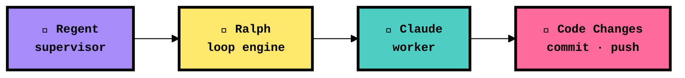
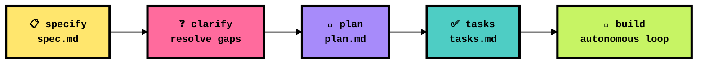
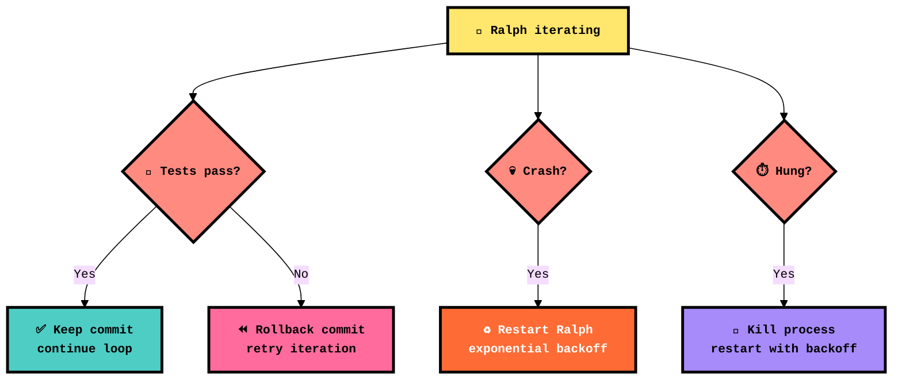

<p align="center">
  
</p>

<h1 align="center">👑 RalphKing</h1>
<p align="center">
  <strong>Spec-driven AI coding loop CLI — with a supervisor that keeps the King honest</strong>
</p>

<p align="center">
  
  
  
  
  
  
</p>

<p align="center">
  <a href="#-quick-start"><b>Quick Start</b></a> · <a href="#-architecture"><b>Architecture</b></a> · <a href="#-spec-kit-workflow"><b>Spec Kit</b></a> · <a href="#-tui-dashboard"><b>TUI Dashboard</b></a> · <a href="#-the-regent"><b>Regent</b></a> · <a href="#-configuration"><b>Config</b></a> · <a href="#-cli-reference"><b>CLI Reference</b></a>
</p>

---

## 📑 Table of Contents

- [⚡ Quick Start](#-quick-start)
- [🏗️ Architecture](#️-architecture)
- [📜 Spec Kit Workflow](#-spec-kit-workflow)
- [🖥️ TUI Dashboard](#️-tui-dashboard)
- [🏰 The Regent](#-the-regent)
- [⚙️ Configuration](#️-configuration)
- [🎯 CLI Reference](#-cli-reference)
- [📁 Project Structure](#-project-structure)
- [🔒 Safety & Guardrails](#-safety--guardrails)
- [🤝 Supported Agents](#-supported-agents)

---

## ⚡ Quick Start

```sh
# 📥 Install
go install github.com/LISSConsulting/LISSTech.RalphKing/cmd/ralph@latest

# 🎬 Initialize a new project
ralph init

# 📋 Create a spec from a description
ralph specify "Add user authentication with JWT tokens"

# 📐 Generate implementation plan
ralph plan

# 🔨 Build it — autonomous loop with TUI dashboard
ralph build

# 👑 Or just launch the dashboard and control everything from there
ralph
```

That's it. Ralph reads your spec, drives Claude through iterations, commits results, and the Regent supervises the whole thing.

---

## 🏗️ Architecture



| Layer | Role | Details |
|-------|------|---------|
| 🏰 **Regent** | Supervisor | Watches Ralph for crashes, hangs, and test regressions. Rolls back bad commits, restarts with backoff. |
| 👑 **Ralph** | Loop engine | Reads specs, builds prompts, invokes Claude, parses streaming JSON output, commits and pushes results. |
| 🤖 **Claude** | Worker | Claude Code CLI — executes the actual coding work within spec boundaries. |

> [!TIP]
> Ralph targets your **active spec** by default. Use `--roam` to let Claude sweep freely across the entire codebase for polish and improvement work.

---

## 📜 Spec Kit Workflow

Specs live in `specs/NNN-name/` directories. Ralph drives Claude through a sequential, spec-driven development lifecycle:



| Command | Artifact | Description |
|---------|----------|-------------|
| `ralph specify` | `spec.md` | Create a feature spec from a natural language description |
| `ralph clarify` | updates `spec.md` | Resolve ambiguities through targeted clarification questions |
| `ralph plan` | `plan.md` | Generate architecture, tech stack, and implementation phases |
| `ralph tasks` | `tasks.md` | Break the plan into ordered, dependency-aware tasks |
| `ralph run` | — | Execute the spec kit run skill against the active spec |
| `ralph build` | code | Autonomous loop — Claude implements tasks, commits, pushes |

```sh
# 📋 List all specs and their status
ralph spec list

#   📋 003-tui-redesign         ✅ Tasked
#   📐 004-speckit-alignment    ✅ Tasked
#   📋 005-spec-bounded-roam    ✅ Tasked
#   📋 006-polish-and-hardening ✅ Tasked
```

> [!NOTE]
> Ralph auto-detects the active spec from your branch name. Branch `005-spec-bounded-roam` maps to `specs/005-spec-bounded-roam/`. Override with the `--spec` flag.

---

## 🖥️ TUI Dashboard

Launch with `ralph` (no arguments) for the full four-panel interactive dashboard:

```
┌─ Specs ──────────┐┌─ Main ─────────────────────────────────────────┐
│ 📋 003-tui-red…  ││ [Live Log] [Summary]                          │
│ 📐 004-speckit…  ││                                                │
│ ✅ 005-spec-bo…  ││ ▶ Iteration 3 — building spec 005              │
│ ✅ 006-polish-…  ││   Reading spec.md... done                      │
│                   ││   Running Claude... streaming                  │
│                   ││   ██████████░░░░░░ 64%                        │
├─ Iterations ─────┤├─ Secondary ───────────────────────────────────┤
│ #1  $0.12  2m    ││ [Regent] [Git] [Tests] [Cost]                 │
│ #2  $0.08  1m    ││                                                │
│ #3  running…     ││ 🏰 Regent: watching · 0 rollbacks              │
│                   ││ 💰 Session: $0.20 · 3 iterations              │
└───────────────────┘└───────────────────────────────────────────────┘
```

### ⌨️ Keyboard Reference

| Key | Action |
|-----|--------|
| `tab` / `shift+tab` | Cycle panel focus |
| `1` `2` `3` `4` | Jump to Specs / Iterations / Main / Secondary |
| `b` | Start build loop |
| `p` | Start plan loop |
| `R` | Smart run (plan if needed, then build) |
| `x` | Cancel running loop immediately |
| `s` | Graceful stop after current iteration |
| `?` | Toggle help overlay |
| `q` / `ctrl+c` | Quit |

**Panel shortcuts:**

| Panel | Keys |
|-------|------|
| 📋 Specs | `j`/`k` navigate · `enter` view · `e` edit in `$EDITOR` · `n` create new |
| 📊 Iterations | `j`/`k` navigate · `enter` view log · `]` switch to summary |
| 📝 Main | `[`/`]` switch tabs · `f` toggle follow · `ctrl+u`/`ctrl+d` page |
| 📡 Secondary | `[`/`]` switch tabs (Regent / Git / Tests / Cost) · `j`/`k` scroll |

> [!TIP]
> Minimum terminal size: **80×24**. Set your accent color via `[tui] accent_color` in `ralph.toml`.

---

## 🏰 The Regent

The Regent is Ralph's supervisor — it watches the loop and intervenes when things go wrong:



| Feature | Description |
|---------|-------------|
| 🧪 **Test-gated commits** | Runs your test command after each iteration; rolls back on failure |
| 💀 **Crash recovery** | Detects process exit, restarts Ralph with exponential backoff |
| ⏱️ **Hang detection** | Kills Ralph if no output for `hang_timeout_seconds` (default: 5 min) |
| 🔄 **Retry with backoff** | Up to `max_retries` restarts with configurable backoff |
| 📡 **Observable** | All Regent actions stream to the TUI Secondary panel |

---

## ⚙️ Configuration

Place `ralph.toml` in your project root. All fields are optional with sensible defaults:

```toml
[project]
name = "MyProject"

[claude]
model = "sonnet"              # Claude model to use
max_turns = 0                 # 0 = unlimited agentic turns per iteration
danger_skip_permissions = true

[plan]
prompt_file = "PLAN.md"       # prompt template for plan iterations
max_iterations = 3

[build]
prompt_file = "BUILD.md"      # prompt template for build iterations
max_iterations = 0            # 0 = unlimited
roam = false                  # --roam flag overrides this

[git]
auto_pull_rebase = true       # pull --rebase before each iteration
auto_push = true              # push after each commit

[regent]
enabled = true
rollback_on_test_failure = false
test_command = "go test ./..."
max_retries = 3
retry_backoff_seconds = 30
hang_timeout_seconds = 300    # kill if no output for 5 min

[tui]
accent_color = "#7D56F4"      # hex color for header/accent elements
log_retention = 20            # session logs to keep; 0 = unlimited

[notifications]
url = ""                      # ntfy.sh topic URL or HTTP webhook
on_complete = true            # notify on iteration complete
on_error = true               # notify on loop error
on_stop = true                # notify when loop finishes
```

### 🔑 Environment Variables

| Variable | Required | Description |
|----------|:--------:|-------------|
| `ANTHROPIC_API_KEY` | ⬜ | Direct API key — Ralph warns if set (prefer Claude Pro/Max subscription) |
| `EDITOR` | ⬜ | Editor for `e` keybind in Specs panel (defaults to system editor) |

> [!WARNING]
> If `ANTHROPIC_API_KEY` is set, Ralph prints a prominent warning on startup. Claude may use direct API billing instead of your subscription. Unset it to avoid unexpected charges.

---

## 🎯 CLI Reference

### Top-level Commands

| Command | Description |
|---------|-------------|
| `ralph` | 👑 Launch the interactive TUI dashboard |
| `ralph init` | 🎬 Scaffold a new ralph project (config, prompts, specs dir) |
| `ralph status` | 📊 Show last run, cost, iteration count, branch |
| `ralph spec list` | 📋 List all specs and their status |

### Spec Kit Commands

| Command | Description |
|---------|-------------|
| `ralph specify "<description>"` | 📋 Create a new spec from a description |
| `ralph plan` | 📐 Generate implementation plan for active spec |
| `ralph clarify` | ❓ Resolve ambiguities in active spec |
| `ralph tasks` | ✅ Break plan into actionable task list |
| `ralph run` | 🚀 Execute spec kit run against active spec |

### Loop Commands

| Command | Description |
|---------|-------------|
| `ralph build` | 🔨 Build mode — autonomous coding loop (alias for `ralph loop build`) |
| `ralph build --roam` | 🌍 Roam freely across codebase, no spec boundary |
| `ralph loop plan` | 📐 Plan mode loop |
| `ralph loop build` | 🔨 Build mode loop |
| `ralph loop run` | 🧠 Smart mode — plan if needed, then build |

### Flags (all loop commands)

| Flag | Description |
|------|-------------|
| `--no-tui` | Disable TUI; print plain log lines to stdout (CI/headless) |
| `--no-color` | Disable ANSI color output (pipe-safe) |
| `--max N` | Override max iterations (0 = use config) |
| `--roam` | Roam freely across the codebase (no spec boundary) |

### Examples

```sh
# 🔨 Standard build with TUI
ralph build

# 🌍 Improvement sweep — roam across the whole codebase
ralph build --roam

# 🤖 Headless build for CI (no TUI, no color, max 10 iterations)
ralph build --no-tui --no-color --max 10

# 🧠 Smart run — plan first if no plan exists, then build
ralph loop run

# 📐 Run 3 planning iterations only
ralph loop plan --max 3
```

---

## 📁 Project Structure

```
📦 LISSTech.RalphKing
├── 📂 cmd/ralph/                   # CLI entry point (cobra)
│   ├── 🎯 main.go                  #   └─ Root command, signal handling
│   ├── 🔧 commands.go              #   └─ Subcommand definitions
│   ├── ⚡ execute.go               #   └─ Loop execution & TUI wiring
│   ├── 🔌 wiring.go                #   └─ LoopController, store, TUI plumbing
│   └── 🛠️ speckit_cmds.go          #   └─ specify/plan/clarify/tasks/run
├── 📂 internal/
│   ├── 📂 claude/                   # Claude CLI adapter & stream-JSON parser
│   ├── 📂 config/                   # TOML config parsing (ralph.toml)
│   ├── 📂 git/                      # Pull, push, branch, stash helpers
│   ├── 📂 loop/                     # Core iteration: prompt → claude → parse → git
│   ├── 📂 notify/                   # Desktop notifications on loop events
│   ├── 📂 regent/                   # Supervisor: crash/hang detection, rollback
│   ├── 📂 spec/                     # Spec file discovery & active spec resolution
│   ├── 📂 store/                    # JSONL session log storage & querying
│   └── 📂 tui/                      # Bubbletea + lipgloss multi-panel TUI
│       ├── 📂 components/           #   └─ Reusable TUI components
│       └── 📂 panels/              #   └─ Specs, Iterations, Main, Secondary
├── 📂 specs/                        # Feature specifications (spec kit layout)
│   ├── 📂 003-tui-redesign/
│   ├── 📂 004-speckit-alignment/
│   ├── 📂 005-spec-bounded-roam/
│   └── 📂 006-polish-and-hardening/
├── 📄 ralph.toml                    # Project configuration
├── 📄 CLAUDE.md                     # AI coding instructions
├── 📄 PLAN.md                       # Plan mode prompt template
├── 📄 BUILD.md                      # Build mode prompt template
└── 📄 CHRONICLE.md                  # Development history & sweep log
```

---

## 🔒 Safety & Guardrails

| Measure | Details |
|---------|---------|
| 📋 **Spec boundaries** | Claude is constrained to the active spec directory by default |
| 🧪 **Test-gated commits** | Regent runs tests after every iteration; bad commits get rolled back |
| ⏪ **Automatic rollback** | Failed test suite → `git revert` → retry with error context |
| ⏱️ **Hang protection** | No output for 5 min → process killed and restarted |
| 💀 **Crash recovery** | Process exit → restart with exponential backoff (up to 3 retries) |
| 🚫 **No global state** | Dependencies passed explicitly; structs hold state, functions transform it |
| 📡 **Full observability** | Every event streams to TUI, JSONL session logs, and optional webhooks |

---

## 🤝 Supported Agents

| Agent | Status | Description |
|-------|:------:|-------------|
| 🤖 Claude Code CLI | ✅ | Default — streaming JSON event parser, full integration |
| 🔮 OpenAI Codex | 🔜 | Planned |
| 💎 Gemini | 🔜 | Planned |
| 🔧 Custom | 🔜 | Bring your own agent via adapter interface |

---

<p align="center">
  
  
  
  <br/>
  <sub><strong>LISS Consulting, Corp.</strong> · <em>Ralph is King. The Regent keeps him honest.</em></sub>
</p>
